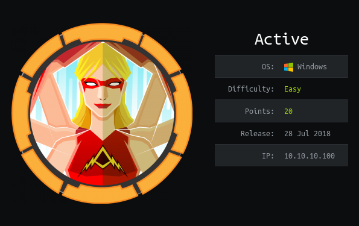
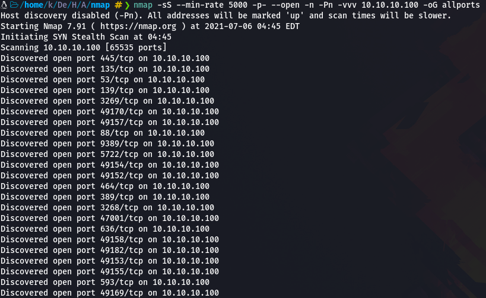

# Write up Active HTB

Hoy vamos a estar resolviendo la maquina Active de HTB, es una maquina Windows de dificultad fácil. En la que vamos a enumerar puertos y buscar en el puerto 445 (SMB) algunos ficheros que no deberíamos de tener acceso.

# **ENUMERACIÓN CON NMAP**

Lo primero de todo como siempre será enumerar que puertos tiene abiertos la maquina, para ellos vamos a utilizar la herramienta "nmap" con la que haremos un escaneo exhaustivo de puertos.

Para hacer un "Fast Scan" de puertos, siempre suelo utilizar esta sintaxis:

`nmap -sS —min-rate 5000 -p- —open -n -Pn -vvv <IPMACHINE> -oN <FILENAME>` 

Yo lo exporto en formato Grep para extraer los puertos con la utilidad "extractPorts" del Youtuber/Streamer "S4vitaar".

Esta utilidad me copia los puertos en la clipboard. Os comparto el Script por aquí pero recordad dejar una estrellita en el Github de S4vitar: (solo tenéis que tener instalado xclip y pegar este código en la .bashrc o .zshrc)

*# Extract nmap information*

function extractPorts**(){**

ports="$(cat $1 | grep -oP '\d{1,5}/open' | awk '{print $1}' FS='/' | xargs | tr ' ' ',')"

ip_address="$(cat $1 | grep -oP '\d{1,3}\.\d{1,3}\.\d{1,3}\.\d{1,3}' | sort -u | head -n 1)"

echo -e "**\n**[*] Extracting information...**\n**" **>** extractPorts.tmp

echo -e "**\t**[*] IP Address: $ip_address" **>>** extractPorts.tmp

echo -e "**\t**[*] Open ports: $ports**\n**" **>>** extractPorts.tmp

echo $ports **|** tr -d '\n' **|** xclip -sel clip

echo -e "[*] Ports copied to clipboard**\n**" **>>** extractPorts.tmp

cat extractPorts.tmp; rm extractPorts.tmp

**}**

Ahora vamos a enumerar versiones y servicios de todos los puertos con Nmap:

`nmap -sC -sV -p<PUERTOS> <IPMACHINE> -oN <FILENAME>`

Vemos muchos puertos abiertos pero no temáis, mucho mejor tener puertos abiertos para poder escanearlos y ver si hay alguna missconfiguración de algun servicio que nos reporte información interesante. Antes que nada como veo el puerto 53 abierto, que es un puerto de servicios DNS, voy a agregar al /etc/hosts la IP de la maquina y el dominio, muchas maquinas de HTB utilizan el nombre de la maquina añadiendo al final .htb:

Y ahora con el dominio añadido voy a utilizar la herramienta "dig" en busca de otros DNS y probaremos un ataque de transferencia de zona pero sin éxito en ninguna:

# **ENUMERACIÓN CON SMBCLIENT**

Vemos que también esta el puerto 445 abierto en el que corre el servicio "Samba" y es un puerto muy importante de enumerar, para ello utilizaremos la herramienta "smbclient" que nos permite ver archivos internos de la maquina:

Con el comando : smbclient -L <IPMACHINE> -N 

-L para listar el contenido 

-N hace referencia a un "null session" (conectarse sin uso de credenciales)

Despues de enumerar toda la maquina encontramos un archivo que por defecto siempre suele tener en su interior credenciales: (Lo transferimos a nuestra maquina con el comando "get")

Usaremos esas credenciales para conectarnos como el usuario "SVC_TGS", pero primero hay que desencriptar esa contraseña, para ello utilizaremos la herramienta "gpp-decrypt":

Ahora nos conectaremos y enumeraremos mas aun el servicio samba, ya que antes habia algunos directorios al cual no podiamos acceder:

Ahora podemos acceder al directorio de SVC_TGS y en Desktop podemos obtener la primera flag:

No muestro la flag porque quiero que practiquéis

# **PRIV. ESCALATION ROOT**

Ahora solo nos falta la segunda flag, vamos a realizar una busqueda de encontrar los nombres principales de servicio que están asociados con la cuenta de usuario normal, cifrará el ticket con la cuenta bajo la que se ejecuta el SPN y esto podría usarse para hacer fuerza bruta contra el hash TGS.

Vamos a utilizar la utilidad GetUserSPNs.py que ya la teneis por defecto en vuestro OS kali linux:

Sintaxis utilizada:

`python3 GetUserSPNs.py -request <HOSTNAME/USERNAME:PASSWORD> -dc-ip <IPMACHINE>`

Podemos ver en el TGS que este ticket pertenece al usuario Administrator, asi que nos podremos contectar por samba proporcionando su usario y su contraseña crackeada. 

Guardamos el TGS ( Ticket-Granting Service) y lo crackeamos con la herramienta "john":

Ya conocemos la contraseña del usuario Administrator, vamos a usarla y sacar la ultima flag:

O para dumpear la SAM de todos los usuarios con CrackMapExec:

Tambien podemos ejecutar comandos con el comando -x :

Espero que os haya servido y hayáis disfrutado que es lo mas importante.