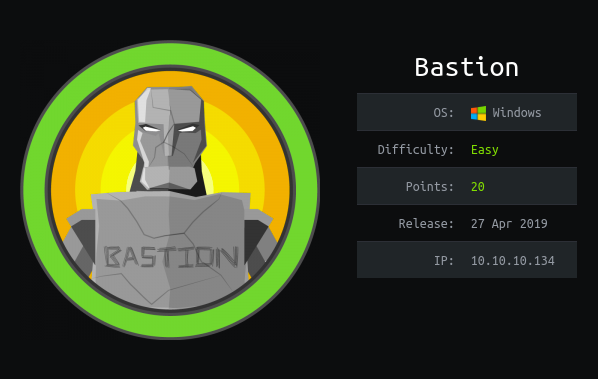

# Bastion HTB

Hola muy buenas a todos! Hoy voy a estar resolviendo la maquina Bastión de HTB, es una maquina Windows de dificultad fácil. Es una de las máquinas Windows de HTB que recomiendan para prepararse el OSCP:

# **ENUMERACIÓN CON NMAP**

Lo primero de todo como siempre será enumerar que puertos tiene abiertos la maquina, para ellos vamos a utilizar la herramienta "NMAP" con la que haremos un escaneo exhaustivo de puertos.

Para hacer un "Fast Scan" de puertos, siempre suelo utilizar esta sintaxis:

`nmap -sS —min-rate 5000 -p- —open -n -Pn -vvv <IPMACHINE> -oN <FILENAME>` 

-sS : 

—min-rate :

-p- : Escaneo de todos los puertos

—open : Mostrar unicamente puertos abiertos

-n : 

-Pn : Para que no haga descubrimientos de hosts

-vvv : 

-oN :

Yo lo exporto en formato Grep para extraer los puertos con la utilidad "extractPorts" del Youtuber/Streamer "S4vitaar".

Esta utilidad me copia los puertos en la clipboard. Os comparto el Script por aquí pero recordad dejar una estrellita en el Github de S4vitar: (solo tenéis que tener instalado xclip y pegar este código en la .bashrc o .zshrc)

[https://pastebin.com/tYpwpauW](https://pastebin.com/tYpwpauW) 

Ahora vamos a enumerar versiones y servicios de todos los puertos con Nmap:

`nmap -sC -sV -p<PUERTOS> <IPMACHINE> -oN <FILENAME>`

-sC : Lanzar una serie de scripts basicos de enumeración

-sV : 

Podemos ver el nombre de la maquina: BASTION

Como siempre me gusta echarle un vistazo primero al puerto 445 (SAMBA), y tenemos permisos de listar el contenido con el uso de un Null Session:

Enumerando el sistema por samba encontramos una nota.

y también encontramos dos .vhd :

estos archivos son muy pesados y tardariamos mucho en descargarnoslos, asi que vamos a hacer una montura para poder visualizar los archivos de la maquina desde nuestra montura (esto no significa que lo tengamos descargados):

vamos a realizar la montura:

`mkdir /mnt/L4mpje-PC`

`mkdir /mnt/vhd`

`modprobe nbd`

`mount -t cifs //10.10.10.134/Backups/WindowsImageBackup/L4mpje-PC /mnt/L4mpje-PC/ -o user=anonymous`

`qemu-nbd -r -c /dev/nbd0 "/mnt/L4mpje-PC/Backup 2019-02-22 124351/9b9cfbc4-369e-11e9-a17c-806e6f6e6963.vhd"`

 `mount -r /dev/nbd0p1 /mnt/vhd`

si el comando qemu-nbd no os funciona teneis que instalarlo:

`sudo apt-get install qemu-kvm qemu virt-manager virt-viewer`

# **ESC. PRIV. ROOT**

Enumeramos la montura y en el directorio Users no vemos nada relevante, asi que enumeramos el directorio : C:\Windows\System32\config

Podemos dumpear la sam con la herramienta samdump2:

y podemos crackear el hash NTLM del usuario l4mpje:

Podemos usar la contraseña para conectarnos por ssh a la maquina:

Enumerando los programas que tiene la maquina instalado encontramos que tiene mRemoteNG:

Por internet encuentro este [post](https://ethicalhackingguru.com/how-to-exploit-remote-connection-managers/) que explica como escalar privilegios abusando de este programa:

Seguimos los pasos del post y encontramos este archivo:

Y dentro del archivo encontramos las credenciales encriptadas del administrador:

Tenemos que desencriptarlas con esta herramienta [mremoteng_decrypt.py](https://github.com/haseebT/mRemoteNG-Decrypt/blob/master/mremoteng_decrypt.py) 

Espero que les haya gustado y sido de ayuda, nos vemos en la siguiente maquina!