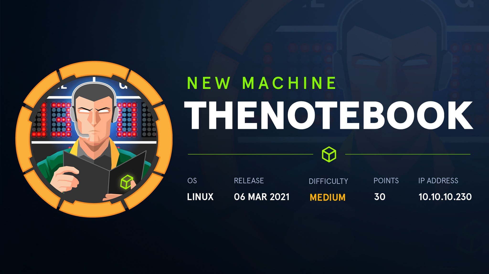

# TheNoteBook

Buenas! Hoy os voy a enseñar a como pwnear la maquina de HTB que acaban de retirar llamada TheNoteBook, es una maquina de dificultad media y de sistema operativo linux, os dejo aquí unas estadísticas de la maquina:

# **ESCANEO**

# **ENUMERACIÓN CON NMAP**

Lo primero de todo como siempre será enumerar que puertos tiene abiertos la maquina, para ellos vamos a utilizar la herramienta "NMAP" con la que haremos un escaneo exhaustivo de puertos.

Para hacer un "Fast Scan" de puertos, siempre suelo utilizar esta sintaxis:

`nmap -sS —min-rate 5000 -p- —open -n -Pn -vvv <IPMACHINE> -oN <FILENAME>` 

-sS : 

—min-rate :

-p- : Escaneo de todos los puertos

—open : Mostrar unicamente puertos abiertos

-n : 

-Pn : Para que no haga descubrimientos de hosts

-vvv : 

-oN :

Yo lo exporto en formato Grep para extraer los puertos con la utilidad "extractPorts" del Youtuber/Streamer "S4vitaar".

Esta utilidad me copia los puertos en la clipboard. Os comparto el Script por aquí pero recordad dejar una estrellita en el Github de S4vitar: (solo tenéis que tener instalado xclip y pegar este código en la .bashrc o .zshrc)

[https://pastebin.com/tYpwpauW](https://pastebin.com/tYpwpauW) 

Ahora vamos a enumerar versiones y servicios de todos los puertos con Nmap:

`nmap -sC -sV -p<PUERTOS> <IPMACHINE> -oN <FILENAME>`

-sC : Lanzar una serie de scripts basicos de enumeración

-sV : 

Con la herramienta `whatweb`podemos sacar algo de información de la pagina web:

En la pagina web podemos crearnos un usuario, nos creamos nuestro propio usuario:

tukutu:test123:test@test.com

Enumerando un poco la pagina vemos una cookie un tanto extraña:

# **EXPLOTACION DE LA VULNERABILIDAD**

Vamos a ver que podemos hacer con ella desde `Burpsuite`

Tiene un formato que se parece a un JSON de JWT, copiamos la cookie y la analizamos en [jwt.io](http://jwt.io) 

Por google encuentro como aprovecharme de esto en este [link](https://blog.pentesteracademy.com/hacking-jwt-tokens-kid-claim-misuse-key-leak-e7fce9a10a9c)

Cambiamos el admin_cap a 1 y nos creamos una key en nuestra maquina local:

vamos a sustituir el admin_cap a 1:

Importante agregar la privkey.key en el jwt.io:

Nos quedaría una cookie de esta forma:

La copiamos y cambiamos la cookie por la creada, y hemos ganado acceso al panel de admin:

# **GANANDO ACCESO A LA MAQUINA**

Podemos subir un archivo; vamos a subir una rev shell:

Editamos el php y lo subimos:

Hemos obtenido una Rev. Shell:

Hacemos el tratamiento de la TTY:

`script /dev/null -c bash`

`CTRL + Z`

`stty raw -echo;fg`

`reset`

`xterm`

`export TERM=xterm`

`export SHELL=bash`

`stty rows [] columns []`

# **PIVOTANDO A NOAH**

Ya tenemos una consola interactiva como el usuario www-data, toca pivotar al usuario noah para luego escalar privilegios:

Enumerando el sistema encuentro en la carpeta backups, un archivo llamado home.tar.gz, me lo voy a traspasar a mi equipo para extraerlo:

Lo descomprimimos dos veces con la herramienta `7z`

`7z x home.tar.gz`

`7z x home.tar`

Una vez descomprimido tenemos acceso a la carpeta home de la maquina, por lo que podemos usar la id_rsa de noah para conectarnos por ssh: (`chmod 600 id_rsa`)

# **ESCALADA DE PRIVILEGIOS**

Toca escalar privilegios a root, con sudo -l nos muestra los programas o comandos que podemos ejecutar con permisos temporales:

Examinando que podemos hacer con el comando:

Podemos ejecutar comandos en un contenedor, vamos a expaunear una bash:

Busco la version del docker para ver si existe algun exploit:

[https://github.com/Frichetten/CVE-2019-5736-PoC](https://github.com/Frichetten/CVE-2019-5736-PoC)

Nos descargamos el main.go y modificamos a nuestro gusto:

Lo compilamos con `go build main.go` , y nos pasamos el archivo main al docker:

Y cuando veamos el Oerwritten ejecutamos en otra ventana :

Ahora /bin/bash es SUID:

