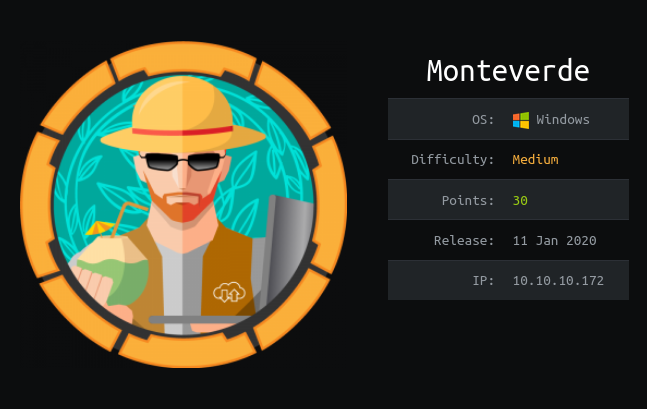

# Monteverde HTB

Hola muy buenas a todos! Hoy voy a estar resolviendo la maquina Monteverde de  HTB, es una maquina Windows de dificultad media, en la que vamos a aprender cosas nuevas de Directorio Activo, en mi opinion es muy importante este tema, ya que el 90% de las empresas lo usan, para el que no sepa que es aqui les dejo una deficion:

Active Directory (AD) o Directorio Activo (DA) son los términos que utiliza Microsoft para referirse a su implementación de servicio de directorio en una red distribuida de computadoras. Un Active Directory almacena información de una organización en una base de datos central, organizada y accesible.

# **ENUMERACIÓN CON NMAP**

Lo primero de todo como siempre será enumerar que puertos tiene abiertos la maquina, para ellos vamos a utilizar la herramienta "NMAP" con la que haremos un escaneo exhaustivo de puertos.

Para hacer un "Fast Scan" de puertos, siempre suelo utilizar esta sintaxis:

`nmap -sS —min-rate 5000 -p- —open -n -Pn -vvv <IPMACHINE> -oN <FILENAME>` 

-sS : 

—min-rate :

-p- : Escaneo de todos los puertos

—open : Mostrar unicamente puertos abiertos

-n : 

-Pn : Para que no haga descubrimientos de hosts

-vvv : 

-oN :

Yo lo exporto en formato Grep para extraer los puertos con la utilidad "extractPorts" del Youtuber/Streamer "S4vitaar".

Esta utilidad me copia los puertos en la clipboard. Os comparto el Script por aquí pero recordad dejar una estrellita en el Github de S4vitar: (solo tenéis que tener instalado xclip y pegar este código en la .bashrc o .zshrc)

[https://pastebin.com/tYpwpauW](https://pastebin.com/tYpwpauW) 

Ahora vamos a enumerar versiones y servicios de todos los puertos con Nmap:

`nmap -sC -sV -p<PUERTOS> <IPMACHINE> -oN <FILENAME>`

-sC : Lanzar una serie de scripts basicos de enumeración

-sV : 

Vemos el nombre del dominio, lo agregamos al /etc/hosts y procedemos a enumerar puertos:

Con RpcEnum vemos una lista de usuarios, lo guardamos por si nos hiciera falta:

No encuentro nada mas interesante con rpcenum, asi que voy a tratar de hacer un ataque de fuerza bruta contra el servicio samba, después de un buen rato con el rockyou sin encontrar nada, pruebo la reutilización de usuarios como contraseñas :

Bingo! SABatcJobs:SABatcJobs

Enumerando el puerto samba encontramos un archivo .xml

Nos lo pasamos a nuestra pagina y bingo! tiene una contraseña:

Nos conectamos con evil-winrm a la maquina:

Leemos la flag:

# **ESC. PRIV. ROOT**

Enumerando el usuario vemos que pertenece al grupo Azure Admins:

Buscando por google encuentro este [post](https://blog.xpnsec.com/azuread-connect-for-redteam/) que nos explica como podemos extraer la contraseña de la base de datos:

creamos un script en powershell tal y como indica la pagina solo cambiando esta linea:

`$client = new-object System.Data.SqlClient.SqlConnection -ArgumentList "Server=127.0.0.1;Database=ADSync;Integrated Security=True"`

lo cargamos en la maquina:

Y hemos conseguido sacar las credenciales de administrador:

Espero que os haya gustado y servidor, para ser una maquina de dificultad media, me ha parecido bastante fácil.